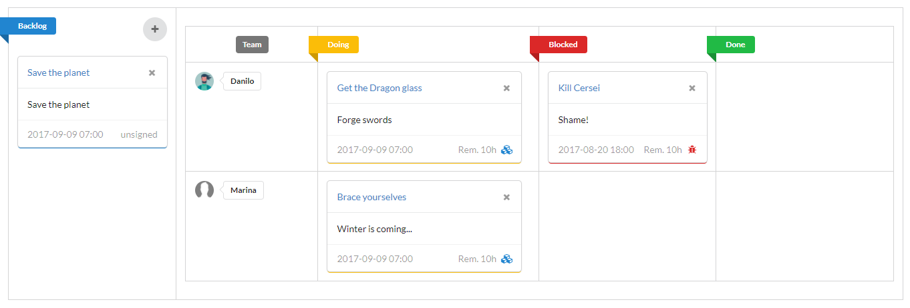

# semantic-kanban [](https://travis-ci.org/danilosampaio/semantic-kanban) [](https://coveralls.io/github/danilosampaio/semantic-kanban?branch=master)

> A simple Kanban component built with Semantic-UI + Vue.js.

## Features

- Drag and drop tasks cards on the kanban board.
- Organize tasks by Owner (Team view)
- Customizable API
- Beautiful

# [](src/assets/print.png)

## Install

```
$ npm install --save semantic-kanban
```


## Usage

```js

<template>
	<semantic-kanban
		:tasks="tasks"
		:members="members"
		:options="options"
		@updateTask="updateTask"
		@deleteTask="deleteTask"
		@updateMember="updateMember">
	</semantic-kanban>	
</template>

<script type="text/javascript">

	import SemanticKanban from 'semantic-kanban'

	export default {
		components: {
			SemanticKanban
		},
		data () {
			return {
				tasks: [{
					id: 1,
					subject: 'Brace yourselves',
					description: 'Winter is coming...',
					status: 'doing',
					dueDate: '2017-09-09 07:00',
					owner: 1
				}],
					members: [{
					id: 1,
					name: 'Danilo',
					avatar: 'img/avatar.png'
				}],
				options: {
					defaultTaskDialog: true,
					defaultConfirmDialog: true,
					defaultMemberDialog: true
				}
			}
		},
		methods: {
			updateTask (task) {
				console.log(task)
			},
			deleteTask (task) {
				console.log(task)
			},
			updateMember (member) {
				console.log(member)
			}
		}
	}
</script>

```


## Customize your tasks

> Standard tasks have the following fields: `id, subject, description, status, dueDate, owner`.
 You can add custom fields, and override some contents of the task card.
 Ex: add `type` field (`'feature'|'bug'`), and cutomize the extra content of the task card:

```js

<template>
	<semantic-kanban
		:tasks="tasks"
		:members="members"
		:options="options"
		@updateTask="updateTask"
		@deleteTask="deleteTask"
		@updateMember="updateMember">
	</semantic-kanban>	
</template>

<script type="text/javascript">

	import SemanticKanban from 'semantic-kanban'

	export default {
		components: {
			SemanticKanban
		},
		data () {
			return {
				tasks: [{
					id: 1,
					subject: 'Brace yourselves',
					description: 'Winter is coming...',
					status: 'doing',
					dueDate: '2017-09-09 07:00',
					owner: 1,
					type: 'feature'
				},
				{
					id: 3,
					subject: 'Kill Cersei',
					description: 'Shame!',
					status: 'blocked',
					dueDate: '2017-08-20 18:00',
					owner: 1,
					type: 'bug'
				}],
		        members: [{
					id: 1,
					name: 'Danilo',
					avatar: 'img/avatar.png'
				}],
				options: {
					defaultTaskDialog: true,
					defaultConfirmDialog: true,
					defaultMemberDialog: true,
					taskExtraContent () {
						return function() {
							const dueDate = this.task.dueDate;
							const remain = 10;
							const icon = this.task.type == 'feature' ? 'blue cubes icon' : 
											this.task.type == 'bug' ? 'red bug icon' : '';
							return `
								<div class="right floated meta">
						  			<span>Rem. ${remain}h</span>
						  			<i class="${icon}"></i>
						  		</div>
						    	${dueDate}
							`;
						}
					}
				}
			}
		},
		methods: {
			updateTask (task) {
				console.log(task);
			},
			deleteTask (task) {
				console.log(task)
			},
			updateMember (member) {
				console.log(member)
			}
		}
	}
</script>

```

### Results:

# [](src/assets/custom.png)


## Props

### `tasks: array of tasks`

#### Task object:
#### `id`
Type: `number`


#### `subject`
Type: `string`

Short title of the task.

#### `description`
Type: `string`

Description of the task.

#### `status`
Type: `string` ('backlog' | 'doing' | 'blocked' | 'done'`)

Status of the task:

`'backlog'`: left column of kanban, containing not started tasks.

`'doing'`: first column of board, containing in progress tasks.

`'blocked'`: second column of board, containing blocked/stoped tasks.

`'done'`: right column of board, containing in done tasks.

#### `dueDate`
Type: `date`

Due date of the tasks. Format: `'YYYY-MM-DD hh:mm'`


#### `owner`
Type: `number`

Member Id from members list.


#### `tags`
Type: `Array`

Tags of the task. 

Ex: ['critical', 'help-wanted'].

Ex2: [{title: 'critical', color: 'red'}].


### `members: array of members`

#### Member object:
#### `id`
Type: `number`


#### `name`
Type: `string`


#### `avatar`
Type: `string`

`href` of ``


### `options: JSON object`

#### `defaultTaskDialog`
Type: `boolean`

Open default dialog for editing task. Set it to false to use a custom dialog.


#### `defaultConfirmDialog`
Type: `boolean`

Open default dialog for delete task. Set it to false to use a custom dialog.


#### `columnLabels`
Type: `array`

Default: `['Backlog','Team','Doing','Blocked','Done']`


#### `newTaskHint`
Type: `string`

Default: `New Task`


#### `newMemberHint`
Type: `string`

Default: `New Member`


#### `backlogTopContent`
Type: `function`

Default return: 
```js

	<div class="right floated meta">
		<i class="${semafor}"><i>
	</div>
	${formattedSubject}

```


#### `backlogExtraContent`
Type: `function`

Default return: 
```js

	<div class="right floated meta">
		<span>${ownerName}</span>
	</div>
	${dueDate}

```


#### `taskTopContent`
Type: `function`

Default return: 
```js

	<div class="right floated meta">
		<i class="${semafor}"></i>
	</div>
	${formattedSubject}

```


#### `taskExtraContent`
Type: `function`

Default return: 
```js

	<div class="right floated meta">
		<span>Rem. ${remain}h</span>
	</div>
	${dueDate}

```


### Events

#### @openTask

Emitted when the task card is clicked.


#### @newTask

Emitted when the `New Task` button is clicked.


#### @updateTask

Emitted when the task is updated by `drag and drop` between the status columns, or when the `save` button is clicked on the task dialog.


#### @confirmDeleteTask

Emitted when the `close` button is clicked.


#### @deleteTask

Emitted when the `confirm` button is clicked.


#### @addTag

Emitted when a new tag is added in the task dialog.


#### @deleteTag

Emitted when a tag is deleted in the task dialog.


#### @updateMember

Emitted when the `save` button is clicked in the member dialog.


## Roadmap
- Add more tests
- Allow add tags in tasks


## License

MIT © [Danilo Sampaio](http://github.com/danilosampaio)
